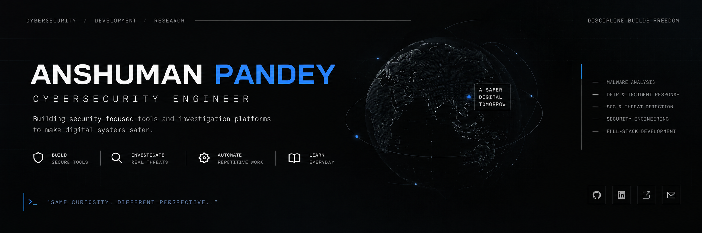



  

# Anshuman Pandey

**SOC Analyst · Security Operations · Threat Detection**

Building hands-on skills in **SOC Operations, Detection, Incident Investigation and Security Monitoring.**

---

### About

I’m focused on **SOC operations, security monitoring and incident investigation**, while building hands-on security projects to strengthen my understanding of real-world defensive workflows.

My current learning path covers **SIEM, log analysis, alert triage, threat detection, incident response and security tooling**.

### Selected Work

| Project | Focus |
| --- | --- |
| **[Malware Analysis Sandbox](https://github.com/anshnpy/malware-analysis-sandbox)** | Malware analysis, static analysis, detection & investigation |
| **[Incident Response Platform](https://github.com/anshnpy/incident-response-platform)** | Incident investigation, evidence handling & response workflows |
| **[SOC Home Lab](https://github.com/anshnpy/soc-home-lab)** | Security monitoring, detection engineering & investigation |
| **[Cybersecurity Portfolio](https://anshumanportfolio.pages.dev/)** | Personal portfolio and security project showcase |

### Technologies

**Security & Systems**

`Linux` `Git` `SIEM` `Networking` `Security Monitoring`

**Development**

`Python` `TypeScript` `JavaScript` `React` `FastAPI` `Node.js`

### Areas of Focus

SOC Operations · Security Monitoring · SIEM · Threat Detection · Incident Response

